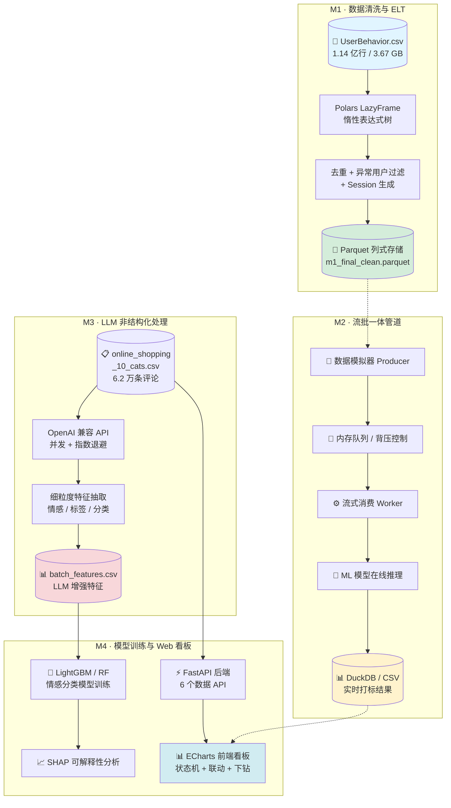

# 大数据分析课程项目

> 基于"轻量级高性能数据栈 + 大语言模型 API"的高校课程实验交付项目
>
> 南昌大学 · 大数据分析 · 2026 春季学期

---

## 项目简介与特色

本项目是一个**端到端大数据分析系统**，涵盖从海量数据 ETL、流批一体管道、LLM 非结构化特征提取，到机器学习模型训练与前端交互看板的完整数据产品交付链路。

### 核心技术特色

1. **千万级脱敏日志极速 ETL**：基于 Polars Lazy API + Parquet 列式存储，在单机 16GB 内存下完成 1.14 亿行用户行为数据的高效清洗、去重与转化漏斗分析，全程零内存溢出。
2. **流式背压管道与 ML/LLM 实时特征预测**：设计有界队列 + 背压信号 + 令牌桶三重流控机制，支持流式数据的实时消费与机器学习模型在线推理打标。
3. **高并发大模型调用容错设计**：使用指数退避重试（Tenacity）+ 异步信号量并发控制，在调用第三方 LLM API 进行文本细粒度特征抽取时实现优雅降级与容错。
4. **前后端解耦的动态可视化看板**：FastAPI 后端 + ECharts 前端，支持全局状态机驱动、品类↔情感双向联动、正则搜索防抖、词云联动与维度下钻。

---

## 系统架构与数据流拓扑



---

## 快速开始与部署指南

### 环境要求

- Python >= 3.10
- 操作系统：Windows / Linux / macOS
- 内存：建议 >= 8GB

### 1. 克隆项目

```bash
git clone <your-repo-url>
cd big-data
```

### 2. 创建虚拟环境

```bash
# Windows
python -m venv .venv
.venv\Scripts\activate

# Linux / macOS
python3 -m venv .venv
source .venv/bin/activate
```

### 3. 安装依赖

```bash
pip install -r requirements.txt
```

### 4. 一键启动（推荐）

```bash
python run_app.py
```

该脚本会自动完成：
- 环境自检（数据文件、端口可用性）
- 启动 FastAPI 后端服务
- 等待服务就绪后自动打开浏览器访问看板
- 按 `Ctrl+C` 优雅关闭所有子进程

### 5. 手动启动

```bash
cd dashboard
uvicorn server:app --host 127.0.0.1 --port 8000
```

浏览器访问：`http://127.0.0.1:8000`

API 文档：`http://127.0.0.1:8000/docs`

---

## 配置说明

### 大模型 API Key 配置

系统支持通过环境变量配置 LLM API Key。若未配置，系统将以降级模式运行（使用内置规则库），前端看板会显示黄色横幅提示。

**支持的 API Key 环境变量：**

| 环境变量 | 对应服务 |
|---------|---------|
| `SILICONFLOW_API_KEY` | 硅基流动 |
| `DASHSCOPE_API_KEY` | 阿里百炼 |

**配置方式：**

```bash
# Windows PowerShell
$env:SILICONFLOW_API_KEY="your-key-here"

# Windows CMD
set SILICONFLOW_API_KEY=your-key-here

# Linux / macOS
export SILICONFLOW_API_KEY="your-key-here"
```

### 修改默认端口

编辑 `run_app.py` 中的 `PORT` 变量，或手动指定 uvicorn 端口：

```bash
uvicorn server:app --host 127.0.0.1 --port 9000
```

### 数据文件配置

系统启动时加载 `online_shopping_10_cats.csv`（62,774 条，10 个品类）作为主数据源。若该文件缺失，服务以空数据集安全启动，并在 `/api/system-status` 中透传降级状态，前端图表显示"暂无数据"。数据文件不入库，需自行放置于项目根目录。

---

## 项目目录树说明

```
big data/                              # 项目根目录
├── run_app.py                         # 一键启动脚本（Week 14 新增）
├── requirements.txt                   # 项目完整依赖清单
├── .gitignore                         # Git 忽略规则（Week 14 新增）
├── README.md                          # 项目文档（本文件）
│
	├── m1_pipeline.py                     # M1: Polars ETL 管道类定义
	├── run_m1_pipeline.py                 # M1: ETL 运行入口
	├── m1_tester.py                       # M1: 管道测试脚本
	├── benchmark.py                       # M1: 性能基准测试
	├── check_parquet_size.py              # M1: Parquet 文件大小检测
	├── upload_release.py                  # M1: 数据上传/发布脚本
	│
	├── m2_producer.py                     # M2: 流式数据生产者
	├── m2_event_generator.py              # M2: 事件模拟生成器
	├── m2_observer.py                     # M2: 背压监控观察者
	├── requirements_m2.txt                # M2: 子模块依赖
	│
	├── task_async_pipeline.py             # M3: 异步高并发 API 管道
	├── run_pipeline.py                    # M3: 管道运行入口
	├── main.py                            # M3: LLM 特征提取主程序
	├── verify_retry.py                    # M3: 重试验证脚本
	├── task2_test_api.py                  # M3: API 测试脚本
	├── config.py                          # 全局配置
	│
	├── week11_ablation_study.py           # Week 11: 消融实验脚本
	│
	├── dashboard/                         # M4: Web 看板系统
	│   ├── server.py                      # FastAPI 后端（7 个 API 端点）
	│   ├── requirements.txt               # 看板子模块依赖
	│   └── frontend/
	│       └── index.html                 # 前端看板页面（ECharts 多图联动）
	│
	└── bigdata1-8.ipynb                   # Week 1-8 Jupyter 实验笔记
```

---

## API 端点一览

| 端点 | 方法 | 参数 | 功能 |
|------|------|------|------|
| `/api/health` | GET | — | 健康检查 |
| `/api/system-status` | GET | — | 系统运行状态与降级信息（Week 14 新增） |
| `/api/category-distribution` | GET | `sentiment` | 品类分布统计 |
| `/api/sentiment-overview` | GET | `cat`, `query` | 情感概览交叉表 |
| `/api/reviews` | GET | `cat`, `sentiment`, `query`, `offset`, `limit` | 评论筛选（正则 + 分页） |
| `/api/word-frequency` | GET | `cat`, `sentiment`, `query`, `top_n` | 高频词统计（jieba 分词） |
| `/api/sub-category-stats` | GET | `cat`, `sentiment`, `query` | 子维度下钻统计 |

---

## 里程碑回顾

| 里程碑 | 周次 | 核心内容 | 关键技术 |
|--------|------|---------|---------|
| M1 | Week 1-3 | 环境搭建、数据 ETL、漏斗分析 | Polars, Parquet, DuckDB |
| M2 | Week 4-8 | 流批一体、背压管道、ML 在线推理 | Queue, Backpressure, Scikit-learn |
| M3 | Week 9-11 | LLM API、非结构化特征、模型训练 | OpenAI API, LightGBM, SHAP |
| M4 | Week 12-14 | Web 看板、多维联动、系统集成 | FastAPI, ECharts, Mermaid |

---

## 许可证

本项目仅用于学习和研究目的。数据集来源于公开渠道。
