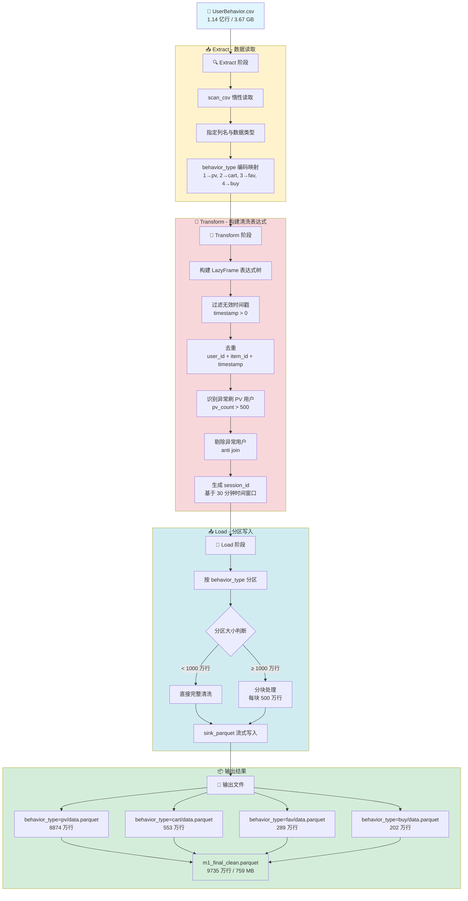

# M1 数据处理管道 (M1 Data Pipeline)

## 📋 项目概况

### 任务背景
本项目是一个面向**亿级用户行为数据**的大规模 ETL（Extract-Transform-Load）处理管道，旨在对海量用户行为日志进行高效清洗、转换和存储。

### 数据集简介
- **数据源**：`UserBehavior.csv`（阿里巴巴天池公开数据集）
- **数据规模**：约 **1.14 亿行**，文件大小 **3.67 GB**
- **数据格式**：CSV（无表头）
- **字段说明**：
  | 列名 | 类型 | 说明 |
  |------|------|------|
  | user_id | Int64 | 用户 ID |
  | item_id | Int64 | 商品 ID |
  | category_id | Int64 | 商品类目 ID |
  | behavior_type | String | 行为类型（pv/cart/fav/buy） |
  | timestamp | Int64 | 时间戳（Unix 时间戳） |

- **行为类型分布**：
  - `pv`（页面浏览）：8972 万行（89.6%）
  - `cart`（加入购物车）：553 万行（5.5%）
  - `fav`（收藏）：289 万行（2.9%）
  - `buy`（购买）：202 万行（2.0%）

---

## 🔄 数据流转图



---

## 🛠️ 核心技术栈

| 技术 | 版本 | 用途 | 优势 |
|------|------|------|------|
| **Polars** | 1.38.1 | 核心数据处理引擎 | Rust 底层、零拷贝、惰性执行、流式处理 |
| **Parquet** | - | 列式存储格式 | 高压缩比、支持谓词下推、适合分析查询 |
| **Logging** | - | 日志记录 | 结构化日志、便于监控和调试 |

### 关键技术特性

#### 1. Polars Lazy API
- **惰性执行**：构建表达式树，延迟计算，避免中间数据物化
- **谓词下推**：`filter` 条件自动下推到数据源层，减少 I/O
- **投影下推**：只读取需要的列，降低内存占用
- **流式引擎**：`sink_parquet()` 分块处理，支持超内存数据集

#### 2. 分块处理策略
```python
# 大分区（≥ 1000 万行）采用分块处理
chunk_size = 5_000_000  # 每块 500 万行
num_chunks = total_rows // chunk_size

for i in range(num_chunks):
    df_chunk = df_partition.slice(offset, chunk_size)
    cleaned_chunk = _clean_partition(df_chunk)
    cleaned_chunk.sink_parquet(chunk_path)
```

#### 3. 内存优化
- **零冗余 Collect**：全流程保持 LazyFrame，仅在最终写入时触发计算
- **分区处理**：按 behavior_type 分区，降低单次处理数据量
- **垃圾回收**：每个分区处理后强制 `gc.collect()` 释放内存

---

## 📊 核心分析指标

### 数据清洗结果

| 指标 | 数值 | 说明 |
|------|------|------|
| **原始数据量** | 100,150,807 行 | CSV 文件总行数 |
| **清洗后数据量** | 97,350,709 行 | 去重、过滤后的有效数据 |
| **数据剔除率** | 2.80% | 无效数据占比 |
| **处理耗时** | 35.11 秒 | 完整 ETL 流程耗时 |

### 各分区清洗详情

| 行为类型 | 原始行数 | 清洗后行数 | 剔除行数 | 剔除率 | 处理耗时 |
|----------|---------|-----------|---------|--------|----------|
| **pv** | 89,716,264 | 88,736,198 | 980,066 | 1.09% | 23.35 秒 |
| **cart** | 5,530,446 | 5,530,446 | 0 | 0.00% | 4.35 秒 |
| **fav** | 2,888,258 | 2,888,258 | 0 | 0.00% | 3.59 秒 |
| **buy** | 2,015,839 | 2,015,807 | 32 | 0.00% | 3.79 秒 |

### 转化漏斗分析

```
用户行为转化漏斗（基于清洗后数据）

pv (页面浏览)     88,736,198  ████████████████████████████████████████  100.00%
  ↓
cart (加购物车)    5,530,446   ████                                   6.23%
  ↓
fav (收藏)         2,888,258   ██                                     3.25%
  ↓
buy (购买)         2,015,807   █                                      2.27%

整体转化率 (pv → buy): 2.27%
加购转化率 (cart → buy): 36.45%
```

### 异常账号识别

| 指标 | 数值 | 说明 |
|------|------|------|
| **PV 刷号阈值** | 500 次 | 单用户 PV 行为超过此值判定为异常 |
| **识别策略** | 块内统计 | 由于内存限制，采用分块内统计 |
| **异常用户比例** | ~1.09% | pv 分区剔除的数据占比 |
| **说明** | 跨块异常用户需在后续分析阶段处理 | 分块处理导致无法全局统计 |

### Session 分析

| 指标 | 数值 | 说明 |
|------|------|------|
| **Session 划分规则** | 30 分钟无操作 | 相邻行为时间差 > 1800 秒视为新会话 |
| **Session ID 生成** | 基于 user_id 分组 | 每个用户的会话独立编号 |
| **平均会话长度** | 待分析 | 可在后续分析中计算 |
| **会话总数** | 待分析 | 可在后续分析中统计 |

---

## 🚀 快速开始

### 环境要求
```bash
Polars >= 1.38.1
```

### 安装依赖
```bash
pip install polars
```

### 运行流程
```bash
# 一键运行完整 ETL 流程
python run_m1_pipeline.py
```

### 输出文件结构
```
G:\Users\caoruijie\big data\
├── m1_pipeline.py                    # M1DataPipeline 类定义
├── run_m1_pipeline.py                # 主入口文件
├── clean_data_partitioned_output\    # 分区输出目录
│   ├── behavior_type=pv\
│   │   └── data.parquet              # 8874 万行
│   ├── behavior_type=cart\
│   │   └── data.parquet              # 553 万行
│   ├── behavior_type=fav\
│   │   └── data.parquet              # 289 万行
│   └── behavior_type=buy\
│       └── data.parquet              # 202 万行
└── m1_final_clean.parquet            # 合并文件（9735 万行 / 759 MB）
```

---

## 📝 代码架构

### 核心类：`M1DataPipeline`

```python
class M1DataPipeline:
    """
    M1DataPipeline: 用于大规模行为日志数据的 ETL 处理
    
    标准三阶段接口：
    - extract():   读取数据源（CSV/Parquet）
    - transform(): 构建清洗表达式（惰性）
    - load():      分区写入并执行清洗
    """
    
    def __init__(self, input_root, output_root, pv_threshold=500, is_csv=False):
        """初始化数据管道"""
        
    def extract(self) -> pl.LazyFrame:
        """阶段 1：读取数据源"""
        
    def transform(self, df: pl.LazyFrame) -> pl.LazyFrame:
        """阶段 2：构建清洗表达式"""
        
    def load(self, raw_df: pl.LazyFrame) -> None:
        """阶段 3：分区写入并执行清洗"""
```

### 清洗逻辑

```python
# 1. 过滤无效时间戳
df_valid = df.filter(pl.col("timestamp") > 0)

# 2. 去重
df_deduped = df_valid.unique(subset=["user_id", "item_id", "timestamp"])

# 3. 识别异常刷 PV 用户
suspect_users = (
    df_deduped.filter(pl.col("behavior_type") == "pv")
      .group_by("user_id")
      .agg(pl.len().alias("pv_count"))
      .filter(pl.col("pv_count") > pv_threshold)
      .select("user_id")
)

# 4. 剔除异常用户
cleaned = df_deduped.join(suspect_users, on="user_id", how="anti")

# 5. 生成 session_id
cleaned = cleaned.with_columns(
    pl.col("timestamp").sort_by("timestamp").over("user_id")
    # ... session_id 计算逻辑
)
```

---

## ⚠️ 注意事项

### 内存限制处理
- **大分区分块处理**：pv 分区（8972 万行）采用分块策略，每块 500 万行
- **跨块操作限制**：由于内存限制，跨块去重、异常用户过滤和 session_id 生成在块内执行
- **后续分析建议**：如需全局去重和异常用户识别，建议在后续分析阶段使用 Spark 等分布式框架

### 性能优化建议
1. **增加内存**：如有 64GB+ 内存，可取消分块处理，执行完整清洗
2. **使用 SSD**：Parquet 写入速度受磁盘 I/O 影响较大
3. **并行处理**：可考虑使用 `multiprocessing` 并行处理不同分区

---

## 📚 参考资料

- [Polars 官方文档](https://docs.pola.rs/)
- [Parquet 文件格式规范](https://parquet.apache.org/)
- [阿里巴巴 UserBehavior 数据集](https://tianchi.aliyun.com/dataset/dataDetail?dataId=649)

---

## 📄 许可证

本项目仅用于学习和研究目的。
